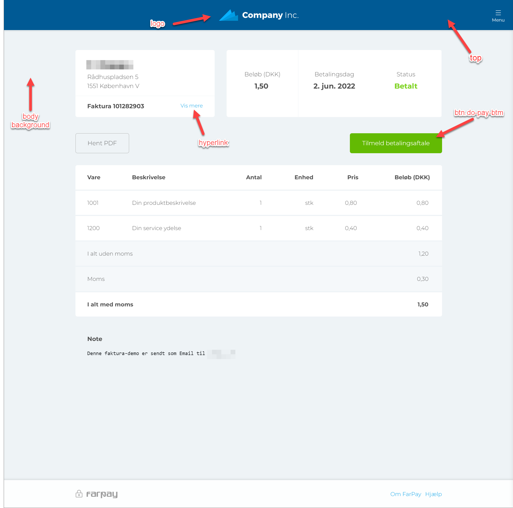
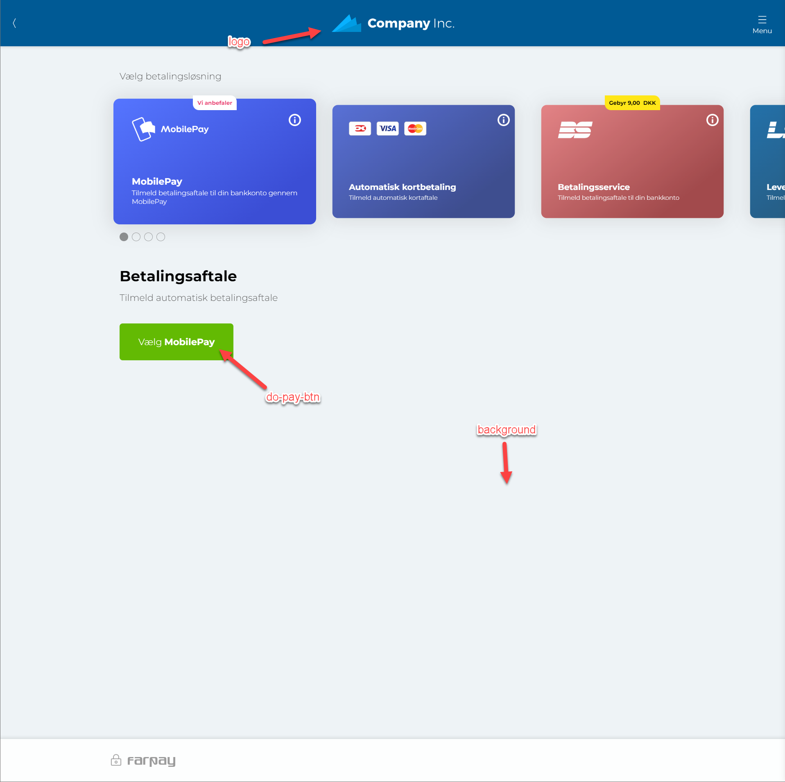

# Branding
Branding is a capability, that enables your business to express your identity-color scheme and upload a custom logo to the invoice- and payment experience in FarPay.

# CSS
Following terms can be cascated:

## Basics

```
<!-- General background color - should be a dimmed white, or white color -->
body {
    background: #eef3f6 !important;
}

<!-- Top background color -->
#top {
    background: #005a95 !important;
}


<!-- Top back color, should have a contract to the background color in order to be visible: {white or dark} --> 
#top .back-btn {
    background-image: url('./../v2/assets/img/icons/icon-back-white.png') !important;
}

<!-- Top back color, should have a contract to the background color in order to be visible: {white or dark} --> 
#top .cancel-btn {
    background-image: url('./../v2/assets/img/icons/icon-close-white.png') !important;
}

<!-- Top back color, should have a contract to the background color in order to be visible: { optional postfix with white} --> 
#top .menu-btn .menu-icon {
    background-image: url('./../v2/assets/img/icons/icon-menu-burger-white.png') !important;
}

#top .menu-btn span {
    color: #fff;
}

<!-- Logo must be in base64 format -->
#top .top-logo {
    background: url('data:image/png;base64,iVBORw0KGgoAAAA...............NH/ZGZRvNY55n9jS==') no-repeat center;
    background-size: 199px 29px;
    height: 29px;
    margin-top: 23px;
}

#top .top-logo img {
    display: none;
}

<!-- examples: "Vis mere", "Om FarPay", "Hjælp" -->
a {
    color: #009de5 !important;
}

<!-- Payment button management; background and text color -->
.btn.do-pay-btn, .btn.choose-method, .btn.btn-continue, .btn.btn-blue {
    background: #63ba03;
    color: #fff;
}

<!-- Payment button management; background and text color, when disabled -->
.btn.do-pay-btn:disabled, .btn.choose-method:disabled, .btn.btn-continue:disabled, .btn.btn-blue:disabled {
    background: #cdcccc;
    opacity: 1;
    pointer-events: none;
}

<!-- Payment button management; background and text color, when :hover -->
.btn.do-pay-btn:hover, .btn.choose-method:hover, .btn.btn-continue:hover, .btn.btn-blue:hover, .btn.do-pay-btn:focus, .btn.choose-method:focus, .btn.btn-continue:focus, .btn.btn-blue:focus {
    background: #56a103;
}

<!-- menu border -->
.app-menu .menu-lang-switch ul li a.active {
    border-color: #009de5 !important;
}

.pink-color {
    color: #e83f6f !important;
}

```




## Form 

```
/* ---------------------------
 FORM
 --------------------------- */

form .form-group.has-border:before {
    background: #009de5 !important;
}

.switch.switch input:checked + .slider {
    background: #009de5 !important;
    border-color: #009de5 !important;
}

.table tr {
    border-color: #eef3f6 !important;
}
```

