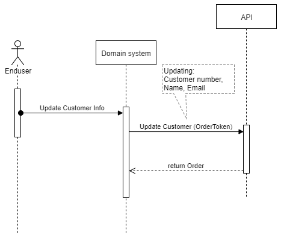

# Payment Window
The secure FarPay Payment Window encapsulates all payment instruments, that are available in your FarPay subscription, enable your existing or new customers to create an payment instrument as well as starting a recurring payment flow.

## Scope
This is a description of how to interact with payment window in your domain system. The overall flow and screens in the payment window are shown here


## Terms
There are a couple of terms, that are in play, when running the Payment Window endpoint.

| Term      | Description |  Available from |
| :---      | :----       |            ---: |
| Order API | The order is placed from your business domain system, initiating an onboarding process | [Order](https://github.com/FarPay/ApiDoc/blob/master/Orders.md) and [Swagger](https://api.farpay.io/swagger/ui/index#/Orders) |
| Order     | The order, that is placed from the your business/domain system, to the FarPay Order API endpoint.| [Example order request](#example-request) |
| OrderResponse | The response, holding the ``OrderToken``, ``ExternalID`` and ``PaymentWindowUrl``| See the [Order details] |
| OrderToken | FarPay internal reference to that specific order | |
| ExternalID | The reference point in your domain system, when receiving orders from FarPay | |
| Payment Window Url | An url, that the user is forwarded to, when the payment information is to be set. | |

# Scenario: User creates an payment agreement
This scenario, a web-user (Actor), wishes to pay for a service or product, by interacting with a domain system.
As the actor, has selected the services or product, the domain system starts interacting with FarPay, to complete the payment as well as the recurring payments. 

## Sequence - Payment window


The FarPay domain comes to play after the user has engaged with the domain system, and is now moving forwared to the finalizing payment and subscription part. This phase is initiated by requesting an Order from the FarPay API. And to create an order, following steps must be executed:

| Step      | Description | Result |
| :---      | :----       | :---   |
| 1 | On behalf of the webuser, the domain system requests an order, and specifies the order' ``ExternalID`` for the system to recognize the order, when getting it back | This results in an Order object |
| 2 | The secured link to the payment window is now available in the domain system, and can be sent to the user as a regular ``https`` request. | The user gets the forward and is landing on the payment window main page |
| 3 | The user now selects what payment instruments he/she wants | The user is forwarded to that specific payment, presented by a secured form to enter the payment credentials |
| 3.1 | There are several payment instruments available from the paymentwindow, now displayed for the user. The direct debit account informations from _Betalingsservice_ and _Leverandørservice_, as well as the _Card_ forms are embedded into the payment window. _MobilePay_ is on the other hand forwarded to a designated page, where the user inputs the _MobilePay phonenumber_, and follows the payment flow on the MobilePay device. |
| 4 | On completion, the FarPay backend system detects the events from the user input, both on the input forms for card and direct debit, as well as from the MobilePay devices, and sends them in a standardized form to the domain system |

# Definition of the Order
The order is also mentioned in the API, but for clarity, the documentation here is focusing on what data needs to be transmitted to the FarPay Order API.

| Name      | Value | Description | M/O |
| :---      | :---- |        ---: |                          ---: |
| ``ExternalID`` | ``string`` | Your internal reference, that you want FarPay to put in the response | M |
| ``AcceptUrl`` | ``string`` | The Url that you want that user to be forwarded to on completed and successfull form inupt | M |
| ``CancelUrl`` | ``string`` | The Url that you want the user to be forwarded to on cancellation | M |
| ``CallbackUrl`` | ``string`` | The Url that the FarPay system should signal, when the payment window has completed its tasks | M |
| ``Lang`` | ``string`` | The language is specified here - accepted values are ``en`` for English, ``da`` for Danish and ``fo`` for Faroese. This is an optional value, but is highly recomended to be set to the desired language. When not set, the payment window will return to English as the default language.| O |
| ``CustomerNumber`` | ``string`` | Customer number, is key to the customer. This is an optional value, and can be updated on the order object later on | O |
| ``CustomerName`` | ``string`` | Customer name is also optional, and can be set later on | O |
| ``CustomerEmail`` | ``string`` | Customer e-mail address is optional too, and can be set later on | O |

_(Remark: The last column is marked M as Mandatory or O as Optional)_

In addition to these information, the order can also contain an _optional node_ of a one-off- or initial payment. When the payment node is present, all the values are *mandatory*. Remark that _Betalingsservice_ and _Leverandørservice_ do not have the ability to perform initial payments, that are executed instantly. These are payment instruments **for recurring payments only**


| Name      | Value | Description | 
| :---      | :---- |        ---: | 
| ``Amount`` | ``decimal`` | decimal number e.g. ``6.50`` |
| ``Currency`` | ``string`` | ``DKK`` is the only currency available when using _Betalingsservice_, _Leverandørservice_ and _MobilePay_ Card can use all common used currencies in scandinavian/European countries |
| ``Description`` | ``string`` | A description, that is sent to the user on the payment window, and to the device running _MobilePay_ |
| ``Reference`` | ``string`` | Your internal reference of the payment |

# Specify the customer
Momentarily after the user has input his/her payment info, the customer information can be set.
This strategy can be used, to keep out garbage customer information from being created without any customer payment information.



The process is quite strait forward. By using the orderToken as key, the order can be updated with the customer information (``customerNumber``, ``customerName``, ``customerEmail``). Details about the API call can be found in the API section when Patching the order.

# Example request
Here is an example of a **order request** with all the reference Url's, language, customer information and a payment of 95.50 Kr. (Danish kroner) 

```
{
  "ExternalID": "YOUR_INTERNAL_REFERENCEPOINT__ABC007",
  "AcceptUrl": "https://companyDomain.com/component/thanks.html",
  "CancelUrl": "https://companyDomain.com/component/likeToContinue.html",
  "CallbackUrl": "https://backend.companyDomain.io/farpayCallback",
  "Lang": "en",
  "CustomerNumber": "1000",
  "CustomerName": "John Hansen",
  "CustomerEmail": "john@hsen.dk",
  "Payment": {
    "Amount": 95.50,
    "Currency": "DKK",
    "Description": "Payment for first 20 days",
    "Reference": "ANOTHER_INTERNAL_PAYMENT_REFERENCE_ABC007"
  },
  "Status" : "Ok"
}
```


